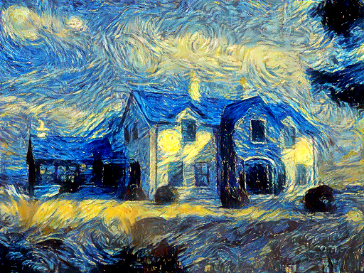

# Neural Artistic Style Transfer 

This is a pytorch implementation of Neural Artistic Style Transfer, which contains both gradient-based methods (e.g., Gatys et al.) and feed-forward methods (e.g., Johnson et al.).

# Setup
All code is implemented in Ubuntu 16.04 with following packages:
1. Pytorch >= 1.0
2. Python >= 3.6
3. Cuda >= 9.0

Install pytorch-colors to preserve original colors of content image onto results. Please follow the README script to install it.

# Examples

## Examples from Gradient-based methods
1. results produced by a normal gradient-based neural style transfer 

  
  
  
   
  
  
  

## Examples from Feed-forward methods

# Parameters
